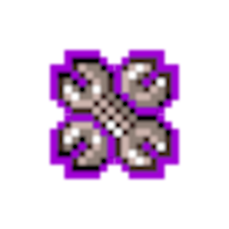

# CC-smoollUtilities
<p align="center">
    
</p>

smoollUtilities is a mod with lots (not quite right now) of QoL (Quality of Life) changes. All of which are toggleable and are not forced upon you.

It supports both the web and Steam versions of Cookie Clicker.

## Features
- `Never Collapse Upgrades Button` - Keep upgrades menu as if it was always being hovered over

Right now that's it but with time, more will come. I already have some new ideas.

## Usage

> [!CAUTION]
> Even though smoollUtilities does not use the CCSE framework, if you want to use it, please be sure to enable it after CCSE. Something in CCSE (that I don't yet understand) is blocking smoollUtilities from injecting it's own HTML into the UpdateMenu() function. In simpler terms, if smoollUtilities is loaded before CCSE, CCSE will break smoollUtilities and you won't be able to play Cookie Clicker. I will try and fix this but for now, we'll have to live with CCSE superiority.

### Web

#### Cookie Clicker Mod Manager (CCMM) | Recommended
This is the easiest method by far for the web version of Cookie Clicker.

If you don't already have it, [install it](https://chromewebstore.google.com/detail/cookie-clicker-mod-manage/gehplcbdghdjeinldbgkjdffgkdcpned?utm_source=chrome-ntp-icon).

After you've installed it, go into CCMM and click the `Register new mod` button (if you can't see it, scroll down).

Paste the URL below into the `URL` field. After you've done that, press the `Save changes` button and you're done. Now, every time you go to play Cookie Clicker, smoollUtilities will be loaded automatically. Pretty cool, if you ask me.

##### URL
```url
https://smooll-d.github.io/CC-smoollUtilities/smoollUtilities.js
```

#### Bookmarklet
Make a new bookmark, you can call it whatever but `smoollUtilities` will tell you that this is smoollUtilities. Then in the `URL Address` field, paste in the code below:

```javascript
javascript:Game.LoadMod("https://smooll-d.github.io/CC-smoollUtilities/smoollUtilities.js");
```

And save it wherever, go on the Cookie Clicker page ([here, i'll help you, click me](https://orteil.dashnet.org/cookieclicker)) and just click the bookmark. Now you should see a notification in the bottom of the page saying that `smoollUtilities` was loaded. You are now a proud (I hope) user of smoollUtilities.

### Steam
If you have Cookie Clicker on Steam, you can go into the Workshop and search up `smoollUtilities`, then subscribe and enable it in the mods menu in Cookie Clicker.

## Contribution
If you'd like to contribute, the easiest way is to [make an issue](https://github.com/smooll-d/CC-smoollUtilities/issues/new) anytime you find a bug. Describe it, tell us which version it happens in (web or Steam) and provide steps to reproduce it.

If you'd like to contribute code. Download the source code using git or just through GitHub and edit the `smoollUtilities.js` file. When you're done, create a fork of CC-smoollUtilities, a new branch with your code in it and create a Pull Request.

## Changelog
Take a look at [CHANGELOG.md](https://github.com/smooll-d/CC-smoollUtilities/blob/master/CHANGELOG.md) for the version history of this mod.
